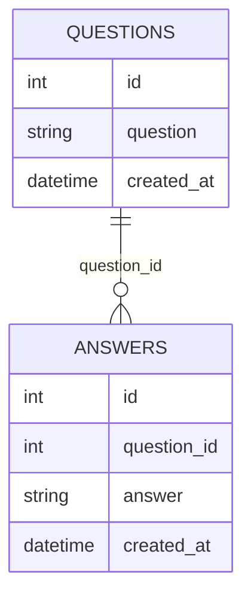

# Backend Internship Home Assignment

This project implements a Flask server that interacts with the OpenAI API to answer questions and stores both questions and answers in a PostgreSQL database. It is dockerized for easy deployment using Docker Compose.

## Prerequisites

- Docker Compose Desktop
- Python 3.10
- Postman (for testing the API endpoints)

## Getting Started

1. **Clone the Repository**

2. **Configure Environment Variables**

Update the environment variables in `docker-compose.yml` and `alembic.ini` to match your local setup:

- **docker-compose.yml**:
  ```yaml
  environment:
    - POSTGRES_DB=<YOUR_POSTGRES_DB_NAME>
    - POSTGRES_PASSWORD=<YOUR_POSTGRES_PASSWORD>
    - POSTGRES_USER=<YOUR_POSTGRES_USER_NAME>
    - POSTGRES_HOST=<YOUR_POSTGRES_HOST>
    - POSTGRES_PORT=<YOUR_POSTGRES_PORT>
    - OPENAI_API_KEY=<YOUR_OPENAI_KEY>
  ```

- **alembic.ini**:
  ```
  sqlalchemy.url = postgresql+psycopg2://<YOUR_POSTGRES_USER_NAME>:<YOUR_POSTGRES_PASSWORD>@<YOUR_POSTGRES_HOST>:<YOUR_POSTGRES_PORT>/<YOUR_POSTGRES_DB_NAME>
  ```

 ### Docker
  The project uses Docker to containerize the Flask application, tests, and PostgreSQL database.
  If you run this project for the first time, run compose commad with the `--build` flag:
  ```
   docker-compose up --build -d
  ```
  To rerun the containers:
  ```
  docker-compose up -d
  ```
 
  This command builds and starts the Flask server, tests and PostgreSQL containers.

5. **Access the Server**

  The Flask server should now be running at `http://127.0.0.1:5000` by default.

## Using Postman

To test the `/ask` endpoint with Postman:

- **Method**: POST
- **URL**: `http://127.0.0.1:5000/ask`
- **Body**: JSON format
```json
{
   "question": "Ask your question here"
}
```


## Database Migration
  The initial database migration is handled using Alembic. Upon starting the containers for the first time, Alembic scripts will automatically create the necessary tables (questions and answers) in your PostgreSQL database.

## Database Schema
* answers table:
  * id: Integer, primary key, autoincrement
  * question_id: Integer, foreign key referencing questions.id, not null
  * answer: Text, not null
  * created_at: DateTime, default: current timestamp
 

* questions table:
  * id: Integer, primary key, autoincrement
  * question: Text, not null
  * created_at: DateTime, default: current timestamp



